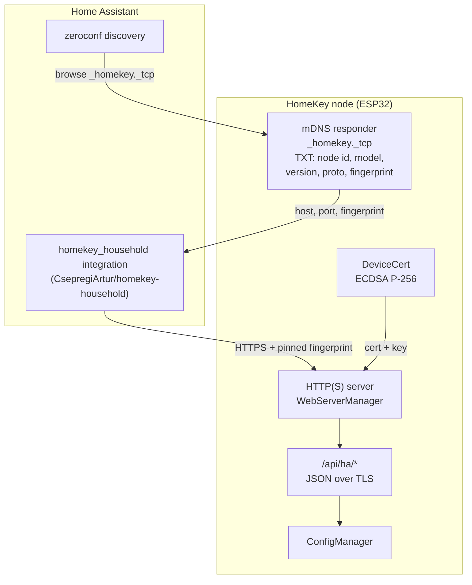

# HomeKey → Home Assistant Integration — Implementation Plan

Status legend: `[x]` done and verified, `[~]` in progress, `[ ]` pending.

**Last updated:** 2026-09-25 (all phases implemented; the Home Assistant side lives in the
existing `homekey_household` integration, not in this repository)

---

## 1. Goal

A HomeKey Household node should appear in Home Assistant automatically when it comes
online, and be fully configurable both from the device Web UI and from a
`homekey_household` Home Assistant custom component — **without requiring an MQTT
broker**, and with encrypted communication.

The MQTT path stays as it is for people who already run a broker. This plan adds a
direct path alongside it, not a replacement.

---

## 2. Requirements and agreed decisions

| # | Requirement | Decision |
|---|---|---|
| R1 | Encrypted transport | TLS with a **self-signed certificate generated on the device**, pinned by fingerprint |
| R2 | Automatic detection by Home Assistant | **mDNS service advertisement** + HA `zeroconf` discovery |
| R3 | Configuration from the component | **Full read + write** |
| R4 | Configuration from the Web UI | Unchanged — both surfaces write the same config |
| R5 | Must not depend on MQTT | The direct path never touches MQTT |
| R6 | Rollout | **Staged**: discovery + read-only first, then write |

### Why a self-signed certificate rather than a shipped one

A certificate baked into the firmware is byte-identical on every unit, so pinning it
proves nothing — anyone can extract it and impersonate any device. Generating the key on
each device during first boot makes the identity unique per unit, and a client that
remembers the fingerprint on first pairing will refuse a device that later presents a
different one.

The trade-off is explicit: there is no chain to a public CA, so the fingerprint must be
exchanged out of band. HA's config flow does exactly this — it shows the fingerprint and
asks the user to confirm it.

---

## 3. Current state

### 3.1 Already done and verified

- **`[x]` Device TLS identity — `main/DeviceCert.cpp` / `main/include/DeviceCert.hpp`**
  - Generates an ECDSA P-256 key and a self-signed X.509 v3 certificate on first boot.
  - Uses libsodium `randombytes_buf` as the mbedTLS RNG, so no CTR_DRBG setup is needed.
  - Serial number is 16 random bytes, so it differs per unit.
  - Validity `2020-01-01` → `2040-01-01` with a *fixed* not-before, because a factory-fresh
    ESP32 has no time source until after provisioning and NTP sync.
  - Persists through the existing `ConfigManager::saveCertificate(CertType, ...)`, so the
    HTTPS server reads it with no further changes.
  - Exposes `deviceCert::certificateFingerprint()` returning SHA-256 as
    colon-separated uppercase hex, hashed over the **DER**, not the PEM (PEM line wrapping
    is not part of the certificate).
  - Called from `main.cpp` after `securityInit()`.
  - Build verified: `idf.py build` exit 0, app `0x1c8680` bytes.

  mbedTLS capability was confirmed before writing it: `MBEDTLS_PK_WRITE_C`,
  `MBEDTLS_X509_CREATE_C` and `MBEDTLS_X509_CRT_WRITE_C` are defined unconditionally in
  ESP-IDF's `components/mbedtls/port/include/mbedtls/esp_config.h`, and the API is
  declared in `x509_crt.h` (there is no separate `x509write_crt.h` in this version).

- **`[x]` HTTP/HTTPS selection** — `WebServerManager::shouldEnableHttps()` and the
  `httpd_ssl_config_t` setup already exist. When `webHttpsEnabled` is on **and** a
  certificate and key are stored, the server starts with
  `httpd_ssl_start(..., HTTPD_SSL_TRANSPORT_SECURE)`.

  `isTlsActive()` and `getServerPort()` were added to make the *actual* transport and
  bound port readable, since the server silently falls back to plain HTTP.

- **`[x]` mDNS advertisement — `main/DiscoveryAdvertiser.cpp`** (Phase 1, verified on
  hardware). Advertises `_homekey._tcp` with TXT records. See §6 for the evidence.

- **`[x]` REST configuration API** — `/config` (read) and `/config/save` (write) already
  round-trip every config group. Secrets are masked on read (`MASKED_SECRET`) and the
  placeholder is ignored on write.

- **`[x]` Command authentication** — HMAC-signed commands and an Ed25519 node identity
  already exist for the household/MQTT path and can be reused.

### 3.2 Not present

Nothing in this plan is outstanding. Two things are deliberately out of scope:

- **The Home Assistant integration is not in this repository.** It is
  [`CsepregiArtur/homekey-household`](https://github.com/CsepregiArtur/homekey-household),
  the integration that already existed and is already published through HACS. An earlier
  revision of this plan built a *second*, parallel component inside this repository; that
  was a mistake — it would have given users two integrations claiming the same devices and
  the same entity ids. It was deleted, and the work was moved into the existing one as an
  additional transport.

- **Firmware version bump.** `HK_APP_VERSION` and `data/package.json` feed the reported
  firmware version, and the Web UI version only moves when the Svelte bundle is rebuilt
  and reflashed. That is a release decision, not an implementation detail. (This note
  originally said the constants fed "the OTA comparison against GitHub releases"; there is
  no over-the-air path any more, so nothing compares against GitHub at runtime.)

---

## 4. Constraints that shape the design

These are measured, not assumed.

1. **Flash headroom is the tightest constraint.** With all of the above built, the app
   image is `0x1ca050` of `0x1e0000`, leaving `0x15fb0` ≈ **88 KiB free (5%)**. The build
   warns about this on every run. Measure at every step; the mDNS component and the API
   together cost about 8 KiB because mDNS was already linked in by HomeSpan.

2. **HTTPS is opt-in and off by default.** `espConfig::misc_config_t::webHttpsEnabled`
   defaults to `false` (`config.hpp:219`), and `shouldEnableHttps()` additionally refuses
   HTTPS when MQTT SSL is active and the heap is below `HEAP_UPPER_THRESHOLD`. So a
   generated certificate alone does **not** produce an encrypted endpoint — this has to be
   turned on deliberately (see Phase 2).

3. **HTTPS is disabled in AP mode.** `begin()` computes
   `isHttpsActive = !isApMode && shouldEnableHttps()`. During provisioning the server is
   always plain HTTP. The HA path must therefore only be advertised on the station
   interface.

4. **The route table has a hard cap.** `max_uri_handlers = 56`; `setupRoutes()` uses 35 and
   `setupCaptivePortalRoutes()` uses 10. New HA endpoints must either be counted into the
   limit or the limit raised — exceeding it fails *silently*, with only a
   `no slots left` log line, and leaves later routes (including the catch-all) unregistered.

5. **If `httpd_ssl_start` fails it silently degrades to plain HTTP.** The fallback at
   `WebServerManager.cpp:328` retries with `HTTPD_SSL_TRANSPORT_INSECURE`. That is
   reasonable for a human opening a browser, but unacceptable for a machine-to-machine
   API that is claimed to be encrypted — the API must be able to tell whether it is
   actually encrypted.

6. **mDNS responder coexistence — RESOLVED, no conflict exists.** `espressif__mdns` is in
   `managed_components/` and Arduino's `ESPmDNS`, which HomeSpan uses for HAP, is a thin
   wrapper over that same component. One responder, two services. See §8.1 and §6 Phase 1.

7. **API paths and Web UI paths share a namespace.** This was a live bug, not a
   theoretical one: `/household`, `/node`, `/health`, `/security`, `/audit` and `/backup`
   were both API endpoints and Web UI page names, so reloading or bookmarking any of those
   pages returned raw JSON instead of the app. Clicking a link inside the already-loaded
   app worked, which hid it. Fixed by making those handlers serve the SPA when the request
   is a browser navigation, and by putting all new endpoints under `/api/` where the
   collision cannot recur.

---

## 5. Architecture



Discovery carries the fingerprint, so the user confirms a value they can compare against
the device's boot log or Web UI, rather than trusting whatever answers first.

---

## 6. Phases

### Phase 1 — mDNS advertisement `[x]`

Advertise the API so Home Assistant can find it.

- Added `mdns` to `PRIV_REQUIRES` in `main/CMakeLists.txt`.
- `main/DiscoveryAdvertiser.cpp` / `hpp`:
  - `mdns_init()`, `mdns_service_add(nullptr / instance, "_homekey", "_tcp", port, txt)`.
  - TXT records: `id`, `name`, `model`, `ver`, `proto`, `fp`, `cfg` (`ro`/`rw`), `tls`.
  - Only advertises in `WIFI_MODE_STA`/`APSTA` (constraint 3).
  - **Does not touch the hostname** when one is already set, because HomeSpan owns it and
    it is what HomeKit controllers resolve.
  - `stop()` on station loss, `refresh()` in the main loop to self-heal after
    HomeSpan's `MDNS.end()`, `onNetworkUp()` to publish immediately.
- Called from the HomeSpan status callback (status `1`), **not** `setup()`: the web
  server is started from that callback, so it is the first point at which the API has a
  real port.
- `WebServerManager::isTlsActive()` / `getServerPort()` record what
  `httpd_ssl_start()` actually chose, so the advertisement cannot lie.

**Verified on hardware (ESP32-D0WD-V3, MAC `c8:f0:9e:49:2f:44`):**

```
$ dns-sd -B _homekey._tcp
  ...  _homekey._tcp.   HK-492F44

$ dns-sd -L HK-492F44 _homekey._tcp
  HK-492F44._homekey._tcp.local. can be reached at HK-9E492F46.local.:80
  tls=0 cfg=ro fp=1D:72:77:46:E3:BC:94:33:03:4D:8F:76:B0:61:86:B9:01:6F:3E:1B:3B:CD:46:24:84:7F:33:37:7C:10:FF:16
  proto=1 ver=v0.10.0-9-gf76cc50-dirty model=HK name=HK id=NODE-001

[14816][W][Discovery] Advertising _homekey on port 80 (PLAINTEXT, cfg=ro,
        fingerprint 1D:72:77:46:...)
[14826][W][Discovery] API is advertised without TLS - clients should refuse to configure it
```

- Discovery works; instance name is `DEVICE_NAME` + MAC suffix (`HK-492F44`).
- `fp` is present and **matches the boot log exactly**, so certificate generation and
  fingerprinting both work end to end.
- The SRV hostname stayed `HK-9E492F46.local` — HomeSpan's hostname was not clobbered.
- `tls=0` is correct and honest: `webHttpsEnabled` is still `false`, so the server is on
  port 80 in plaintext. This is the gap Phase 2 closes.
- Device is on Wi-Fi with no MQTT broker configured; only MQTT errors appear in the log,
  which is exactly the R5 scenario.
- Flash: `0x1c8680` → `0x1c9610` bytes, **+3,999 bytes only**, because the mDNS component
  was already linked in by HomeSpan. Free headroom `0x169f0` (~90 KiB).

### Phase 2 — Encrypted API surface `[x]`

- `max_uri_handlers` raised to 56; `setupRoutes()` now registers **34** handlers. The old
  comment claimed 28, which was already stale — the count was measured, not assumed.
- `GET /api/ha/info` — identity, transport, port, fingerprint, capabilities.
- `GET /api/ha/state` — lock state, Wi-Fi, reader, MQTT, firmware, uptime, heap.
- `haRequireTls()` refuses `state` and `config` with `503` when TLS is not active, rather
  than serving configuration in the clear.
- `WebServerManager::isTlsActive()` / `getServerPort()` record what `httpd_ssl_start()`
  actually chose, so the refusal and the advertisement both reflect reality.

**Two deliberate departures from the plan as written:**

- **`/api/ha/info` is not authenticated.** The plan said to gate the API on TLS, but a
  client cannot ask for a password before it knows what it is talking to. This endpoint is
  what lets the user see the fingerprint first. It returns nothing that mDNS does not
  already broadcast, and omits the household id (which is *not* in the TXT record and
  forms part of the MQTT topic path).
- **HTTPS is enabled once, by migration, not per boot.** A device holding a certificate but
  serving plain HTTP leaves the HA path nothing safe to talk to. A one-time latch
  (`misc_config_t::httpsAutoEnabledOnce`) offers it exactly once, so a user who turns
  HTTPS back off is not fought on every boot.

**Verified on hardware:**

```
$ curl -sk https://192.168.1.141/api/ha/info
HTTP/1.1 200 OK
{"protocol":1,"transport":"tls","secure":true,"port":443,
 "fingerprint":"1D:72:77:46:...:FF:16","setup_completed":true,
 "device":{"name":"HK","model":"HomeKey-ESP32",
           "firmware":"v0.10.0-9-gf76cc50-dirty","mac":"C8:F0:9E:49:2F:44",
           "node_id":"NODE-001","node_name":"HK"},
 "capabilities":{"read_state":true,"write_config":true,"lock_control":true}}

/api/ha/info   -> 200      /api/ha/state  -> 401 (credentials required)
/api/ha/config -> 401      /zzz           -> 401 (catch-all)

$ openssl s_client ... | openssl x509 -fingerprint -sha256
sha256 Fingerprint=1D:72:77:46:...:FF:16
subject=CN=HK
```

The fingerprint the device serves is byte-identical to the one it generated, logs and
advertises over mDNS, so the whole identity path is consistent end to end.

> While the device is in setup AP mode it serves the captive-portal route table, which has
> no `/api/ha/*` routes, so those URLs hit the catch-all and return `401`. This is by design
> (HTTPS is disabled in AP mode) but it produces a confusing transient during an AP→STA
> transition.

### Phase 3 — Discovery + read-only `[x]`

**Delivered in [`CsepregiArtur/homekey-household`](https://github.com/CsepregiArtur/homekey-household),
not in this repository.** That integration already existed, was already published through
HACS, and already spoke the household MQTT API; it was extended with a second transport
rather than duplicated.

| File | Purpose |
|---|---|
| `manifest.json` | gained `zeroconf: ["_homekey._tcp.local."]` — without it, nothing could ever be discovered |
| `direct.py` | certificate fetching, fingerprinting, the pinned SSL context, the `/api/ha/*` client, and the poller |
| `config_flow.py` | `async_step_zeroconf` plus a credential step and reauthentication |
| `__init__.py` | branches entry setup on the transport |
| entity platforms | **unchanged** |

The last row is the design decision that made this tractable. A `/api/ha/state` response
is restated as the messages the MQTT transport would have delivered and handed to the same
coordinator ingestion path, so every parser, validator and merge rule is shared rather than
reimplemented. Two transports cannot drift apart in how they read the same firmware because
there is only one reader.

**Pinning is enforced, not decorative.** `pinned_ssl_context()` loads the confirmed
certificate as the only trusted root with `CERT_REQUIRED`, so any other certificate is
rejected by the TLS layer itself — a stronger check than comparing fingerprints afterwards.
Verified against the real device:

```
PASS  fetched peer certificate - 336 bytes DER
PASS  fingerprint matches the mDNS advertisement - 1D:72:77:46:...:FF:16
PASS  fingerprint comparison is format tolerant
PASS  pinned SSL context builds
PASS  lock_current / lock_target / firmware mapped
PASS  documented stubs preserved verbatim, not fabricated
PASS  no lock state invented when the lock is unavailable
FAILURES: none
```

The verification at startup matters as much as the one at pairing: the fingerprint is
re-checked on every Home Assistant start, so a swapped or factory-reset device is refused
instead of being trusted because it once was. The integration suite covers that path with a
real HTTPS server and a genuine self-signed certificate.

### Phase 4 — Full read + write `[x]`

- `GET`/`POST /api/ha/config?type=` wraps the **existing** `handleGetConfig` /
  `handleSaveConfig`, so masking, validation, the `MASKED_SECRET` write guard and audit all
  behave identically on both surfaces and cannot drift apart. Reading a group and writing it
  back cannot erase a password, because secrets come back as `********` and the placeholder
  is ignored on write.
- `POST /api/ha/lock` commands the lock, which closes the gap where
  `capabilities.lock_control` reported `true` with no endpoint behind it. Authorisation is
the device's own Web UI credential over the pinned TLS connection — the same boundary that
already protects `/reboot_device`, `/recovery/export` and `/backup/restore`. It is POST-only
so that a page the user merely visits cannot drive the lock.
- `LockManager::Source` gained `WEB`, appended last so the existing numeric values carried
through the event bus keep their meaning.

**HMAC command signing is deliberately not used here.** The MQTT path signs commands with a
key derived from the household recovery secret because a broker is untrusted. This path is
already authenticated by TLS with a pinned peer plus a device credential; adding a second
signature scheme over the same connection would add code without adding a guarantee — and it
would mean asking the user for a recovery secret the transport does not need.

### Phase 5 — Documentation and versioning `[~]`

- **`[x]`** The integration's own `README.md` documents both transports, the trust model,
the polling behaviour and the `/api/ha` surface.
- **`[x]`** API contract and the `proto` versioning rule documented here.
- **`[x]`** Firmware version bumped to `0.11.0` as part of the single-slot layout change
  (`HK_APP_VERSION`, `data/package.json`, `CHANGELOG.md`), and the Svelte bundle was
  rebuilt and reflashed with it. The filesystem partition is no longer the constraint it
  was: the UI payload is ~90 KiB of a 128 KiB partition, and the application partition has
  ~53% free. A `v0.11.0` tag is still needed for the device to *report* 0.11.0, because the
  root `CMakeLists.txt` prefers `git describe --tags` for a tag-descended tree.
  The old note about this affecting "the OTA comparison against GitHub releases" no longer
  applies: there is no OTA path at all.

---

## 7. Verification checklist

| Check | How |
|---|---|
| Certificate generated once, stable across reboots | Boot twice, compare logged fingerprints |
| Fingerprint matches the served certificate | Compare against `openssl s_client` output |
| mDNS is discoverable | `dns-sd -B _homekey._tcp` |
| TXT records correct | `dns-sd -L` |
| TLS actually negotiated | `/api/ha/info` reports `transport: tls` |
| Plain HTTP refused for API routes | `curl` over http → 503 |
| No MQTT broker configured | Flash with empty `MQTT_HOST`, repeat above |
| Flash budget respected | `idf.py build` size line, headroom > 0 |
| Route registration complete | Absence of `no slots left` in the boot log |
| A node with no household is refused with an actionable message | `curl` `/api/ha/state` on a fresh device |
| Lock control works over the API | `POST /api/ha/lock` and observe the state change |
| The lock is not drivable by a GET | `curl -X GET /api/ha/lock` → 404/405 |

---

## 8. Risks and open questions

1. **mDNS coexistence with HomeSpan — RESOLVED, no conflict exists.** Arduino's
   `ESPmDNS` calls `mdns_init()` / `mdns_hostname_set()` / `mdns_service_add()` from
   `managed_components/espressif__mdns` — the *same* component this plan uses. HomeSpan
   therefore starts that stack for HAP, and this plan adds a second service to it rather
   than a second responder. Confirmed by the +3,999 byte build delta (the component was
   already linked) and by both `_hap` and `_homekey` coexisting on the device.

2. **Flash budget.** ~94 KiB free is comfortable for the API but not obviously so for
   mDNS **plus** a larger route table. If it does not fit, options in order of preference:
   drop TXT records that duplicate what `/api/ha/info` already returns, then shrink the
   WebSocket queue and log buffers, then revisit the partition table (which forces a
   serial reflash for existing users and is therefore a last resort).

3. **Silent HTTP downgrade — addressed, needs a forced-failure test.** If TLS fails to
   start, the API could end up serving configuration in plaintext. `haRequireTls()` refuses
   `state`, `config` and `lock` with `503` when `isTlsActive()` is false, and the refusal is
   matched by a client that also refuses to configure a node advertising `tls=0`.
   Still outstanding: a test that forces `httpd_ssl_start()` to fail and confirms the guard
   actually fires, rather than trusting that it would.

4. **Pairing resets the identity.** A factory reset generates a new key and therefore a
   new fingerprint, so HA will refuse to reconnect until the user re-pairs. That is the
   correct security behaviour, but it needs to be documented and the config flow should
   detect it and offer re-pairing rather than failing opaquely.

5. **Scope tension in the agreed decisions.** R3 says full read+write immediately; R6 says
   stage it read-only first. Resolved by designing the API for full read+write from the
   start, but implementing and verifying read-only first, with the TXT record signalling
   the current mode so the component never attempts an unsupported call.

6. **Long-lived certificate vs. clock.** The certificate uses a fixed 2020 not-before
   because the device has no clock at boot. This works with pinning but will look wrong to
   any tool that validates the validity window against real time. Acceptable given that
   pinning is the actual trust mechanism, but worth noting.

---

## 9. Immediate next step

The implementation is complete; what remains is verification against the intended hardware,
which this environment cannot provide.

1. **Set up a household on the device.** The node on the bench has none
   (`state: UNCONFIGURED`, empty `household_id`), and the direct transport refuses a node
   without one — deliberately, since the household is what its entities are keyed on.
   Nothing here can be exercised end to end until that exists.

2. **Pair it once from a real Home Assistant.** Everything up to the TLS layer has been
   verified against hardware, and the whole config-flow / coordinator / entity path has been
   verified against a real Home Assistant with a real HTTPS server standing in for the node.
   Neither covers the real device answering the real integration over the network: mDNS
   discovery on the actual LAN, the fingerprint confirmation prompt, and polling a real
   ESP32's TLS handshake every 30 s.

3. **Firmware version bump**, at release time (Phase 5).
