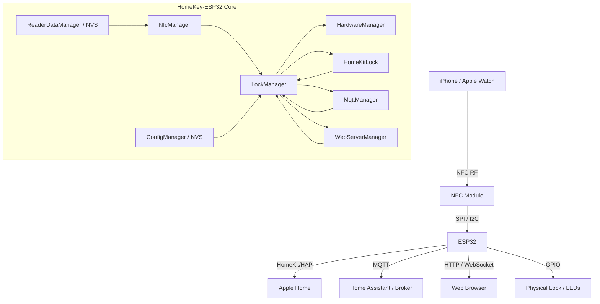

# HomeKey-ESP32 — Comprehensive Project Description

> [!IMPORTANT]
> **This is a fork of [rednblkx/HomeKey-ESP32](https://github.com/rednblkx/HomeKey-ESP32)**
> (MIT). Upstream is the original project and remains the reference for the core
> HomeKey / HomeKit / NFC functionality. This fork adds the **Household multi-node**
> architecture, authenticated MQTT control, encrypted backups and on-device flash
> encryption; see the [README](README.md).

## 1. What it is

> [!IMPORTANT]
> **Fork vs upstream — at a glance.** See [Fork vs Upstream](docs/content/fork-vs-upstream.md)
> for the full comparison.
>
> | Area | Upstream `0.9.0` | This fork `0.10.0` |
> | --- | --- | --- |
> | Scope | Single device | **Household** of multiple nodes |
> | Backup / provisioning | — | Encrypted+signed backup; one-time join codes |
> | MQTT | Legacy topics | **+ household namespace**, HA discovery, HMAC commands |
> | Web UI | Misc/MQTT/OTA/Logs | **+ household, node, health, security, audit, backup, recovery, provision** |
> | Flash encryption | **Disabled** | **Supported** (off by default) |
> | Secure Boot | **Disabled** | **Supported** (off by default, V1 ECDSA-P256) |
> | NVS encryption | **Disabled** | **Supported** (off by default) |
>
> **Right now this fork builds and flashes exactly like upstream** — the hardening is
> implemented but off, so the board stays fully reversible. Enabling it is a deferred,
> staged, one-way rollout: see
> [Security Rollout Plan: Path 1 → Path 2](docs/content/PATH2_SECURITY_ROLLOUT.md).
>
> **Unchanged from upstream:** HomeKey/NFC protocol, lock logic, HomeKit accessory
> model, existing Web UI pages and all existing MQTT topics.

**HomeKey-ESP32** is an open-source DIY firmware (MIT-licensed) that brings **Apple HomeKey** — the NFC-based "tap your iPhone/Apple Watch to unlock" feature — to ordinary ESP32 hardware. Instead of buying a HomeKey-certified smart lock, you wire an NFC reader to an ESP32, flash this firmware, and the device becomes a HomeKey reader plus a full smart-home lock accessory.

- **Version:** `0.10.0` (household multi-node release, 2026-09-22)
- **Framework:** ESP-IDF ≥ 5.5.4 (CI builds against 5.5.5), C++ with heavy use of modern features
- **Also buildable via PlatformIO** (`platformio.ini`, ESP-IDF framework, 4 MB flash / `with_ota.csv` partition table)
- **Not affiliated with Apple**; the HomeKey protocol was reverse-engineered by the community

The tagline: *"Apple HomeKey functionality for the rest of us"* — no proprietary hardware, just an ESP32 and a supported NFC module.

---

## 2. Purpose & capabilities at a glance

| Capability | Description |
|---|---|
| **Apple HomeKey** | Express Mode, Power Reserve, iPhone + Apple Watch, sub-300 ms taps |
| **HomeKit** | Native Apple Home integration via HomeSpan (lock, NFC service, battery) |
| **MQTT** | Home Assistant / OpenHAB integration, HA auto-discovery, tag events |
| **Web UI** | Svelte 5 + Tailwind SPA for configuration, logs, OTA |
| **Captive portal** | First-boot Wi-Fi + HomeKit configuration without recompiling |
| **OTA** | Firmware and LittleFS (web UI) updates over the network |
| **Hardware actions** | Relays/GPIO, NeoPixels, feedback LEDs, alternate action button |
| **Ethernet** | Wired networking as an alternative to Wi-Fi |
| **Security** | First-run credential setup, Web UI auth, HTTPS/mTLS, OTA verification, **optional flash encryption + Secure Boot V1 + NVS encryption** (disabled by default), HMAC-authenticated MQTT commands, encrypted signed backups |

---

## 3. System architecture



The design is a **pub/sub event bus** (`app_events.hpp` + `app_event_loop`) — managers emit and subscribe to events (`LOCK_EVENT`, `NFC_EVENT`, `HK_EVENT`, `HW_EVENT`, `MQTT_EVENT`, `ETH_APP_EVENT`) rather than calling each other directly. `LockManager` is the single source of truth for lock state.

---

## 4. Core modules (`main/`)

### 4.1 Application entry — `main.cpp`
- Boot sequence: GPIO/UART init, NVS init, logging init, default event loop, **reset-reason reporting** (distinguishes panic/WDT/brownout from a clean boot), `ConfigManager::begin()`, `securityInit()`, then constructs all managers.
- **First-run security**: a factory-fresh device keeps the shipped placeholder credentials, leaves Web UI authentication **off** and shows a blocking setup screen in the Web UI, where the user chooses the **Setup Code, setup AP password, OTA password and Web UI password**. Submitting it sets `setupCompleted` and turns authentication on. Already-configured devices are migrated to `setupCompleted` automatically and never rewritten.
- The setup AP advertises as **WPA2-PSK with CCMP** rather than WPA2/WPA3 mixed mode, because the mixed-mode WPA3 cipher suite caused association failures ("connection timeout") on a range of clients.
- Runs the AP/captive-portal workflow when there is no working network, and the main loop (`homeSpan.poll()` + 50 ms yield).

### 4.2 `NfcManager` — NFC orchestration
- Owns a `INfcReader` backend, runs a **polling FreeRTOS task**, handles tag presence, HomeKey authentication and generic tags.
- Optional **auth precompute cache** (faster taps, more CPU/RAM) and **fast polling**.
- Talks to the HomeKey stack via the `DigitalDoorKey` (`ddk::Session`, `ddk::Flow`) library.

### 4.3 NFC backends — common `INfcReader` interface
A unified abstraction over three readers so the manager is hardware-agnostic:

| Reader | Interface | File |
|---|---|---|
| **PN532** | SPI | `Pn532Reader.cpp` (`components/pn532_cxx`, `pn532_hal`) |
| **PN7161** | SPI + IRQ/VEN | `Pn7160Reader.cpp` (`components/pn7160`) |
| **ST25R3916** | I2C | `St25r3916Reader.cpp` |

Interface covers lifecycle (`init`/`stop`/`isConnected`), firmware version, discovery/polling (`beginDiscovery`, `pollForTag`, `isTagStillPresent`, `releaseTag`), APDU exchange, health checks and ECP update.

### 4.4 `LockManager` — lock state machine
- States: `UNLOCKED(0)`, `LOCKED(1)`, `JAMMED(2)`, `UNKNOWN(3)`, `UNLOCKING(4)`, `LOCKING(5)`.
- Tracks **current** and **target** state; `setTargetState()` triggers physical actions, `overrideState()` syncs external reports (MQTT/HomeKit).
- Optional **"always lock/unlock on HomeKey"**, momentary-pulse timers for "dumb switch" mode, and command-source awareness (HomeKit/NFC/MQTT).

### 4.5 `HomeKitLock` — Apple Home integration (HomeSpan)
- Builds the HAP accessory: `LockMechanism`, `NFCAccess` (HomeKey credential provisioning via `HK_HomeKit`), `LockManagement`, `AccessoryInformation` and `BatteryService`.
- Handles pairing callback, AP-start callback, Ethernet bring-up, debug console commands, lock state propagation to/from HomeKit, battery reporting.

### 4.6 `MqttManager` — smart-home bridge
- Full MQTT client lifecycle (connect, LWT, TLS), publishes lock state and NFC/HomeKey taps, subscribes to command topics.
- **Home Assistant MQTT Discovery** for the lock, HomeKey issuer tag, endpoint tag and generic NFC tag.
- Detailed error reporting (`MqttErrorCode`: connection refused, auth failed, network, SSL, timeout).
- Warns on every non-TLS connection (command topics can unlock the door).

### 4.7 `WebServerManager` — HTTP/HTTPS + WebSocket
- `esp_http_server` (HTTP) and `esp_https_server` (TLS) with static file serving from LittleFS (brotli/gzip/uncompressed).
- REST endpoints for config get/save/clear, NFC presets, Wi-Fi scan, captive-portal config, reboot, HomeKit reset, Wi-Fi reset, start AP, metrics/info.
- **OTA upload** (firmware + LittleFS) with task-based streaming and progress broadcast.
- **Certificate management** (server cert/key, optional CA for mTLS), fingerprint/expiry reporting.
- **WebSocket** for live logs, metrics and OTA progress (with drop counting/backpressure observability).
- Security hardening: `Host` header validation (DNS-rebinding), POST-only state changes, constant-time credential comparison with failure delay, secret masking.

### 4.8 `HardwareManager` — physical I/O
- Controls the lock output (relay/motor driver), **NeoPixel** feedback, success/failure/tag-event GPIO pulses, and an **alternate action** input (ISR + debounce) with its own LED.
- Uses `GPIOAllocator` for safe pin leasing (rejects strapping pins unless overridden) and `SharedLed`.

### 4.9 Persistence
- **`ConfigManager`** — versioned config structs serialized (JSON ↔ MessagePack, via `espp/serialization`) into **NVS**; certificate storage/validation with mbedTLS; NVS-backed log level and backlog size.
- **`ReaderDataManager` (`NvsCredentialStore`)** — implements `ddk::CredentialStore`: reader identity (key material), enrolled issuers/endpoints, snapshots for UI, erase/reset operations.

### 4.10 Networking
- Wi-Fi (STA/AP/APSTA + WPA2/WPA3) and **Ethernet** (`EthernetDriver`, PHY presets: W5500, DM9051, KSZ8851, LAN8720/10, TLK110, RTL8201, DP83848, KSZ8041, KSZ8081; RMII only on ESP32-WROOM-32).
- **Captive portal** with DNS server (`components/dns_server`) redirecting all hosts to the config page; setup AP auto-restarts after 10 idle minutes.

### 4.11 Logging & diagnostics
- `loggable` / `loggable_espidf` sink framework with two sinks: serial **`ConsoleLogSinker`** and **`WebSocketLogSinker`** (live streaming to the browser), configurable level and backlog.

---

## 5. HomeKey protocol stack — `components/DigitalDoorKey` (DDK)

This is the cryptographic heart, split into:
- **`homekey/`** — Apple HomeKey (ECP/NDEF, Fast/Slow flow, TLV result processing)
- **`aliro/`** — next-generation **Aliro** standard support (compile-time selectable via `Kconfig`: `CONFIG_DDK_PROTOCOL_HOMEKEY` / `CONFIG_DDK_PROTOCOL_ALIRO`)
- **`auth/`** — HK/Attestation and Aliro authentication
- **`crypto/`** — secure channels (`ScbSecureChannel`, `GcmSecureChannel`, `ISO18013SecureContext`)
- **`session/`, `store/`, `transport/`** — session management, credential stores, transports
- **`HK_HomeKit`** — TLV-based credential provisioning/removal and reader-key setting for HomeKit
- Depends on **libsodium**, **mbedTLS**, **CBOR/tinycbor**

The project notes an upcoming Aliro-based successor supporting flash encryption from the start.

---

## 6. Other bundled components

| Component | Role |
|---|---|
| **HomeSpan** | HomeKit Accessory Protocol framework (pairing, services) |
| **pn532_cxx / pn532_hal** | PN532 SPI driver (modern C++ wrapper + HAL) |
| **pn7160** | NXP PN7160/PN7161 NCI driver |
| **dns_server** | Captive-portal DNS interception |
| **loggable / loggable_espidf** | Pluggable logging sinks, ESP-IDF hook |
| **msgpack-c** | MessagePack serialization for config |
| **managed_components/** | Registry deps: arduino-esp32, littlefs, espp/serialization, libsodium, cbor, mDNS, etc. |

---

## 7. Web interface (`data/`)

- **Svelte 5 + TypeScript + Tailwind CSS 4 + daisyUI**, router via `sv-router`, built with Vite.
- Pages/routes: **Info** (device metrics, NFC/MQTT status, HomeKey reader GID/ID/issuers), **MQTT** (broker, TLS, topics, custom states, HA discovery), **Actions** (NeoPixel/GPIO/relay/state triggers, alternate action), **System/Misc** (HomeKit identity, hardware pins, Ethernet, HomeSpan, Security/HTTPS/certs), **OTA Update**, **Logs** (virtualized live stream, level filter, JSON export), **Captive Portal** (Wi-Fi scan + first-boot setup).
- Live data over WebSocket; assets brotli-compressed (91 kB) to fit the 128 kB filesystem partition.

---

## 8. MQTT interface (summary)

- **Publish:** `.../homekit/state` (retained), `.../homekey/auth` (HomeKey or generic tag JSON), `.../alt_action`, `.../homekit/custom_state`, `<id>/status` (LWT online/offline).
- **Subscribe:** `.../homekit/set_state`, `set_current_state`, `set_target_state`, `set_custom_state`, `set_battery_lvl`.
- **HA Discovery** entities: lock, HomeKey issuer tag, endpoint tag, generic NFC tag.

Example auth payloads:

```json
{
  "endpointId": "000000000000",
  "homekey": true,
  "issuerId": "0000000000000000",
  "readerId": "0000000000000000"
}
```

```json
{
  "atqa": "0004",
  "homekey": false,
  "sak": "08",
  "uid": "00000000",
  "readerId": "A1B2C3D4E5F6"
}
```

---

## 9. Security model (documented in `docs/content/security.md`)

**Default (no config):**
- First-run setup screen asks the user to choose the Setup Code, setup AP password, OTA password and Web UI password. Nothing is generated or logged.
- Web UI authentication stays off until that screen is saved; secrets are never returned to the browser (masked as `********`).
- HomeSpan `espota` disabled until a custom OTA password is set.
- The setup AP password is the shipped `HomeKey$123$` until the user changes it during setup; HomeSpan's own AP is aligned with it so the published `homespan` value never opens either one.
- Temporary WPA2-PSK (CCMP) AP (max 2 clients, idle restart after 10 min).
- POST-only + `Host`-validated state changes; login throttling (2 s after 5 failures).
- No Bluetooth stack compiled in (Wi-Fi/SRP HomeKit pairing only).

**User-enabled:**
- Web UI auth + HTTPS/mTLS with uploaded certificates.
- MQTT TLS + per-device broker user/ACL (MQTT is an unlock path).
- Network segmentation (IoT SSID/VLAN).
- Optional OTA image signature verification (`CONFIG_SECURE_SIGNED_APPS_NO_SECURE_BOOT`, no eFuses needed).

**Explicit non-goal:** flash encryption / secure boot — physical USB access is considered a full compromise by design, to avoid forcing every deployed device to be re-provisioned.

---

## 10. Build & tooling

- **ESP-IDF:** `idf.py build` / `flash` / `monitor`; web UI is built with **bun** and flashed as a LittleFS image via `littlefs_create_partition_image`.
- **PlatformIO:** `pio run`, `pio run -t upload`; needs a local ESP-IDF checkout ≥ 5.5.4 (`scripts/setup_local_idf_package.sh`) because the registry package lacks `ws_post_handshake_cb`; extra scripts build the web UI and flash the FS.
- **`fmt`** fetched via `FetchContent`; **minimal build** enabled.
- **Versioning:** `CMakeLists.txt` derives `PROJECT_VER` from git (`v0.10.0`, or `0.10.0-dev+<commit>[-dirty]`), surfaced in Web UI, device info and the HomeKit firmware revision.
- **Docs:** Hugo site under `docs/` (setup, configuration, MQTT, automations, updates, troubleshooting, security, API reference) published to GitHub Pages.

---

## 11. Repository layout

```
main/          Core app (managers, readers, HK services, web server, events)
components/    DigitalDoorKey (HomeKey/Aliro), HomeSpan, PN532/PN7160 drivers,
               dns_server, loggable, msgpack-c
data/          Svelte 5 web UI (captive portal + main interface)
docs/          Hugo documentation site
scripts/       PlatformIO pre/post IDF + local IDF setup
managed_components/  Registry dependencies
sdkconfig.defaults[.esp32] / with_ota.csv / platformio.ini  Build configuration
```

---

## 12. Supported hardware

**Board:** ESP32 development board (4 MB flash).

**NFC readers:**
- **PN532** (SPI)
- **PN7161** (SPI + IRQ/VEN)
- **ST25R3916** (I2C)

**Ethernet PHYs:** W5500, DM9051, KSZ8851, LAN8720/LAN8710, TLK110, RTL8201, DP83848, KSZ8041, KSZ8081. The RMII-based chips (LAN87xx, TLK110, RTL8201, DP83848, KSZ8041, KSZ8081) require an ESP32-WROOM-32 board because other variants lack the internal EMAC.

**Integrated board presets:** @lollokara (ESP32-C3, SPI), CASmo-NFC (SPI), CASmo-NFC-MB-ETH (SPI).

---

## 13. Legal / disclaimer

MIT-licensed and community-maintained. It implements HomeKey via reverse engineering, is **not affiliated with or condoned by Apple**, may lack private-spec behavior, and is used **at your own risk** for security-critical applications. Apple/iPhone/Apple Watch are trademarks of Apple Inc.; ESP32 of Espressif; Home Assistant of Open Home Foundation.
