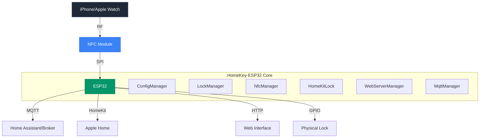

<div align="center">
  

  # HomeKey-ESP32
  [](https://discord.com/invite/VWpZ5YyUcm)
  [](https://github.com/rednblkx/HomeKey-ESP32/actions/workflows/esp32.yml)
  [](LICENSE)

  **Apple HomeKey functionality for the rest of us**

  [Documentation](https://rednblkx.github.io/HomeKey-ESP32/)

</div>

> [!IMPORTANT]
> **This is a fork.** It is based on
> [rednblkx/HomeKey-ESP32](https://github.com/rednblkx/HomeKey-ESP32) (upstream, MIT),
> which remains the original project — all core HomeKey, NFC and HomeKit work is
> theirs. Please send upstream bugs there and use this repository only for the
> fork-specific additions below.
>
> **What this fork adds (0.10.0)**
> - **Household / multi-node architecture** — several nodes (gate, main house,
>   garage, …) share trust and recovery material, each with its own
>   non-transferable device identity.
> - **Encrypted, signed household backups** (XChaCha20-Poly1305 + Ed25519).
> - **Authenticated MQTT control** — lock/unlock over HMAC-SHA256 commands with
>   replay protection, plus a documented Home Assistant MQTT discovery surface.
> - **Flash encryption, Secure Boot V1 and NVS encryption supported**
>   (implemented but **off by default**; enabling is a deferred, irreversible step —
>   see the security warning below).
> - New Web UI pages: household, node, health, security, audit, backup, recovery,
>   provision.
>
> See [`docs/content/household.md`](docs/content/household.md),
> [`docs/content/mqtt_household_api.md`](docs/content/mqtt_household_api.md) and
> [`docs/content/mqtt_api_contract_matrix.md`](docs/content/mqtt_api_contract_matrix.md).

## This fork vs. the original project

This repository is a **fork of [rednblkx/HomeKey-ESP32](https://github.com/rednblkx/HomeKey-ESP32)**.
Upstream is the original project and is where the core HomeKey / HomeKit / NFC work
lives. This table is the complete summary of what differs; the full explanation is
in [`docs/content/fork-vs-upstream.md`](docs/content/fork-vs-upstream.md).

| Area | Original project (`0.9.0`) | This fork (`0.10.0`) |
| --- | --- | --- |
| Scope | Single device | **Household** of multiple nodes |
| Node identity | — | Ed25519 keypair per node, never cloned |
| Backup | — | **Encrypted** (XChaCha20-Poly1305) + **signed** (Ed25519) |
| Provisioning | — | Single-use, expiring, replay-protected join codes |
| MQTT | Single-device legacy topics | **Additive** household namespace + HA discovery |
| MQTT lock/unlock | Plain numeric payloads | **HMAC-SHA256 authenticated** commands |
| Web UI | Misc, MQTT, OTA, Logs, Actions | **+ household, node, health, security, audit, backup, recovery, provision**; OTA page **removed** (no over-the-air update) |
| Audit log | — | Bounded 256-record log |
| **Flash encryption** | **Disabled** (deliberate) | **Supported** — currently off, AES-256 eFuse key when enabled |
| **Secure Boot** | **Disabled** | **Supported** — currently off, V1 (ECDSA-P256) when enabled |
| **NVS encryption** | **Disabled** | **Supported** — currently off, `nvs_keys` partition when enabled |
| Partition table | `0x8000`, no `nvs_keys` | Same as upstream right now; moves to `0xD000` with `nvs_keys` when enabled |

**Unchanged from upstream:** the HomeKey/NFC protocol, `LockManager` lock logic,
the HomeSpan/HomeKit accessory model, the existing Web UI pages, and all existing
MQTT topic names and payloads (the household namespace is additive).

**Right now this fork boots and flashes exactly like upstream** — no eFuses are
burned and no device data is lost. The security features are opt-in and documented
in [`docs/content/PATH2_SECURITY_ROLLOUT.md`](docs/content/PATH2_SECURITY_ROLLOUT.md).

## What is HomeKey-ESP32?

The project aims to be the easy DIY solution for using Apple's HomeKey feature without the need to purchase a compatible smart lock that you probably don't want. HomeKey-ESP32 brings Apple's secure NFC-based unlocking to an ESP32 module near you, enabling you to unlock doors and whatnot with a simple tap of your iPhone or Apple Watch.

**No proprietary hardware required** – just an ESP32 and one of the supported NFC modules

> [!CAUTION]
> **This fork *supports* flash encryption, Secure Boot V1 and NVS encryption, but
> they are DISABLED by default.** The board is therefore fully reversible today:
> no one-time eFuses are burned and nothing is destroyed.
>
> Enabling them is a **separate, deferred, one-way step**. Do not enable anything
> until you have read
> [`docs/content/PATH2_SECURITY_ROLLOUT.md`](docs/content/PATH2_SECURITY_ROLLOUT.md).
>
> When you do enable it, the consequences are:
>
> - These protections burn one-time eFuses. There is no way back.
> - **Already-deployed devices must be re-flashed over serial** and completely
>   re-provisioned. Wi-Fi credentials, HomeKit pairing and HomeKey reader
>   enrolment stored on the device **are lost and cannot be recovered**.
> - The partition layout changes (`nvs_keys` added, partition table moved to
>   `0xD000`, app offsets realigned), so firmware from an older build cannot be
>   installed by any route but a serial flash — and there is no OTA path on the
>   current single-slot layout in any case.
> - Every future firmware image must be signed with the Secure Boot key; you can
>   no longer flash arbitrary unsigned binaries.
> - The flash-encryption key and the signing key must both be backed up
>   off-machine. Losing either permanently ends your ability to update the device.
>
> If you are upgrading an existing installation, **back up your household
> recovery secret and HomeKey configuration first**.
>
> **Path 1 / Path 2 — choose deliberately:**
>
> | Path | What it does | Reversible? |
> | --- | --- | --- |
> | **Path 1 — current** | No eFuses burned, no encryption. Behaves like upstream; plaintext flashing works normally. | ✅ Yes |
> | **Path 2 — deferred** | Burns the eFuses, encrypts the flash, Secure Boot locks the device to your signing key. Encrypted + signed images only. | ❌ **Permanent** |
>
> Path 2 is itself staged — flash encryption, then NVS encryption, then Secure
> Boot, then release mode — verifying each stage on hardware before the next.
>
> Upstream deliberately kept flash unencrypted to avoid forcing a migration on
> existing users. This fork keeps that default while making the hardening
> available to those who want it.

## Getting Started

> [!TIP]
> A wiki documenting the project can be found at https://rednblkx.github.io/HomeKey-ESP32/

### Prerequisites

- **ESP32 Development Board**
- **NFC reader** - one of:
  - **PN532** (SPI)
  - **PN7161** (SPI) - available in the dev release
  - **ST25R3916** (I2C) - available in the dev release
- **USB Cable** (for flashing and power)
- **Computer** (Windows, Mac, or Linux)
- **Basic Electronics Knowledge** (not a problem if you're new to this, ask away!)

#### Ethernet

The following chips are supported for Ethernet:

-  W5500
-  DM9051
-  KSZ8851
-  LAN8720 / LAN8710
-  TLK110
-  RTL8201
-  DP83848
-  KSZ8041
-  KSZ8081

> [!IMPORTANT]
>
> The following are only supported for ESP32-WROOM-32 boards as other variants lack the internal EMAC needed for the RMII interface:
> -  LAN8720 / LAN8710
> -  TLK110
> -  RTL8201
> -  DP83848
> -  KSZ8041
> -  KSZ8081

### Installation Steps

1. **Download Firmware**
   - Visit [GitHub Releases](https://github.com/rednblkx/HomeKey-ESP32/releases/latest)
   - Download the `*.firmware.factory.bin` file
   - This contains everything you need - no compilation required!

2. **Connect Your Hardware**
   - Wire your chosen NFC module to your ESP32 using the default pins
   - Refer to the [detailed wiring guide](https://rednblkx.github.io/HomeKey-ESP32/setup/#21-nfc-module-wiring) for your specific setup

3. **Flash the Firmware**
   ```bash
   # Install esptool (one-time setup)
   pip install esptool
   
   # Flash the firmware (replace YOUR_PORT)
   esptool.py --port /dev/ttyUSB0 write_flash 0x0 firmware.factory.bin
   ```
   
   **Prefer a GUI?** Use the [browser-based flasher](https://espressif.github.io/esptool-js/) - no command line needed!

4. **Initial Setup**
   - Connect to the device's WiFi AP (`HK_XXXXXX`). The password is `HomeKey$123$` until you set your own on the setup screen.
   - Access the web interface at `http://192.168.4.1` - type the address, phones do not auto-open the portal
   - Configure your WiFi credentials, HomeKit setup code and Web UI login
   - Open the device's Web UI on your network and finish the **first-run setup screen**: Web UI username + password, HomeKit Setup Code and setup AP password. Until you save it the Web UI has **no login**, so only do this on a trusted network.
   - Pair with Apple Home using the Setup Code you chose (the shipped `466-37-726` applies until you set your own)

> [!NOTE]
> A factory-fresh device asks you to choose its credentials rather than generating and printing them. See [Security](docs/content/security.md) for the full flow, and for what to do if a credential is lost.

5. **Start Using HomeKey!**
   - Hold your iPhone or Apple Watch near the NFC reader
   - Enjoy instant, secure access to your home! 🎉

### Updating

Follow the update in the documentation at: https://rednblkx.github.io/HomeKey-ESP32/updates/

Review [CHANGELOG.md](CHANGELOG.md) before updating: some releases change security defaults or the update procedure itself (for example, the firmware has to be updated before the filesystem image). The [Security](docs/content/security.md) page explains the first-run setup flow and how to recover a lost credential.

## System Architecture

<div align="center">
  


</div>

## ✨ Key Features

### **Apple HomeKey Integration**
- **Express Mode**: Unlock without waking your device
- **Power Reserve**: Unlock even when the device needs to be charged
- **Multi-Device Support**: Works with iPhone and Apple Watch
- **Fast Authentication**: Sub-300ms unlock times

### **Smart Home Ready**
- **HomeKit Native**: Full Apple Home ecosystem integration
- **MQTT Support**: Connect to Home Assistant, OpenHAB, and other platforms
- **Home Assistant Discovery**: Automatic device detection and configuration
- **Custom States**: Support for complex lock states (jamming, unlocking, etc.)

### **Modern Web Interface**
- **Svelte Frontend**: Responsive, modern UI built with Svelte 5 + Tailwind CSS
- **Real-time Updates**: WebSocket-powered live status updates
- **Configuration Management**: Easy setup without recompiling
- **Serial-only updates**: no over-the-air path by design, so nothing on the network can replace the firmware

### **Developer Friendly**
- **Open Source**: MIT licensed, community-driven development
- **Modular Architecture**: Clean separation of concerns
- **Event System**: Pub/sub architecture for extensibility
- **Comprehensive Logging**: Debug and monitor with detailed logs

## Development

```mermaid
graph TD
  %% External Systems & Hardware
  subgraph "External World"
      A[iPhone / Apple Watch]
      B[Apple Home]
      C[Web Browser]
      D[MQTT Broker]
      E[Physical Lock, Buttons & LEDs]
  end

  %% Main Application on ESP32
  subgraph "HomeKey-ESP32 Core"
      
      subgraph "Interface Managers (I/O)"
          direction LR
          Nfc[NfcManager]
          HK[HomeKitLock]
          Web[WebServerManager]
          Mqtt[MqttManager]
          Hw[HardwareManager]
      end

      subgraph "Logic Core (State Machine)"
          Lock[LockManager]
      end

      subgraph "Data Services (Persistence)"
          direction LR
          Config[ConfigManager]
          Reader[ReaderDataManager]
          NVS[(NVS Storage)]
      end

      %% High-level Data and Control Flow
      DataServices[Data Services] -- "Provides Config & Reader Data" --> InterfaceManagers[Interface Managers]
      DataServices -- "Provides Config" --> LogicCore[Logic Core]
      Config -- "Reads/Writes" --> NVS
      Reader -- "Reads/Writes" --> NVS
      
      InterfaceManagers -- "State Change Requests (e.g., Unlock)" --> Lock
      Lock -- "Actions & State Updates" --> InterfaceManagers
  end
  
  %% Connections to the External World
  A -- NFC --> Nfc
  B -- HomeKit --> HK
  C -- HTTP/WebSocket --> Web
  D -- MQTT --> Mqtt
  E -- GPIO --> Hw
  
  Hw -- GPIO --> E
  HK -- HomeKit --> B
  Web -- HTTP/WebSocket --> C
  Mqtt -- MQTT --> D

  %% Styling for clarity
  style A fill:#1f2937,stroke:#374151,color:#fff
  style B fill:#1f2937,stroke:#374151,color:#fff
  style C fill:#1f2937,stroke:#374151,color:#fff
  style D fill:#1f2937,stroke:#374151,color:#fff
  style E fill:#1f2937,stroke:#374151,color:#fff

  style Nfc fill:#3b82f6,stroke:#2563eb,color:#fff
  style HK fill:#059669,stroke:#047857,color:#fff
  style Web fill:#f59e0b,stroke:#d97706,color:#fff
  style Mqtt fill:#ef4444,stroke:#dc2626,color:#fff
  style Hw fill:#8b5cf6,stroke:#7c3aed,color:#fff

  style Lock fill:#ec4899,stroke:#db2777,color:#fff
  
  style Config fill:#6b7280,stroke:#4b5563,color:#fff
  style Reader fill:#6b7280,stroke:#4b5563,color:#fff
  style NVS fill:#9ca3af,stroke:#6b7280,color:#fff
```

<div align="center">
  


</div>

### Project Structure

```
HomeKey-ESP32/
├── main/                    # Core ESP32 application
│   ├── main.cpp            # Application entry point
│   ├── ConfigManager.cpp    # Configuration management
│   ├── ReaderDataManager.cpp # Reader data management
│   ├── NfcManager.cpp      # NFC communication
│   ├── Pn532Reader.cpp     # PN532 backend (SPI)
│   ├── Pn7160Reader.cpp    # PN7160 backend
│   ├── St25r3916Reader.cpp # ST25R3916 backend (I2C)
│   ├── HomeKitLock.cpp     # HomeKit integration
│   ├── LockManager.cpp     # Lock state management
│   ├── MqttManager.cpp     # MQTT client
│   ├── WebServerManager.cpp # Web interface
│   ├── WebSocketLogSinker.cpp # WebSocket logging sinker
│   ├── HardwareManager.cpp # Hardware manager
│   └── HKServices.cpp # HomeKit services
├── data/                   # Web interface files
│   ├── src/               # Vue.js application
│   └── index.html         # Web UI entry point
├── components/            # External dependencies
│   ├── HK-HomeKit-Lib/   # HomeKey implementation
│   ├── HomeSpan/         # HomeKit framework
│   └── PN532/            # NFC driver
└── docs/                 # Documentation
    └── content/          # Hugo documentation
```

### Core Components

| Component | File | Purpose |
|-----------|------|---------|
| **NFC Manager** | [`NfcManager.cpp`](main/NfcManager.cpp) | Drives the selected NFC backend and HomeKey authentication |
| **NFC Backends** | [`Pn532Reader.cpp`](main/Pn532Reader.cpp) / [`Pn7160Reader.cpp`](main/Pn7160Reader.cpp) / [`St25r3916Reader.cpp`](main/St25r3916Reader.cpp) | Reader implementations behind the common `INfcReader` interface |
| **HomeKit Bridge** | [`HomeKitLock.cpp`](main/HomeKitLock.cpp) | Manages Apple HomeKit integration and pairing |
| **Lock Manager** | [`LockManager.cpp`](main/LockManager.cpp) | Controls lock state transitions and GPIO actions |
| **MQTT Client** | [`MqttManager.cpp`](main/MqttManager.cpp) | Enables smart home integration via MQTT |
| **Web Server** | [`WebServerManager.cpp`](main/WebServerManager.cpp) | Provides the configuration UI and the Home Assistant direct API |
| **Config Manager** | [`ConfigManager.cpp`](main/ConfigManager.cpp) | Handles persistent configuration storage |

### Building from Source

```bash
# Install dependencies
git submodule update --init --recursive

# Install esp-idf v5.4 or newer -- CI builds against v5.5.4.
# Earlier versions do not compile: the pn7160 and pn532_hal components use
# esp_log_buffer.h and spi_bus_dma_memory_alloc, both introduced in v5.4.
# See https://docs.espressif.com/projects/esp-idf/en/latest/esp32/get-started/index.html#get-started

# Build firmware
idf.py build

# Flash to device
idf.py -p /dev/ttyUSB0 flash

# Monitor output
idf.py monitor
```

### Contributing

Contributions are welcomed! Please see the [Contributing Guidelines](CONTRIBUTING.md) for details.

1. Fork the repository
2. Create a feature branch (`git checkout -b feature/amazing-feature`)
3. Commit your changes (`git commit -m 'feat: Add amazing feature'`)
4. Push to the branch (`git push origin feature/amazing-feature`)
5. Open a Pull Request against the `main` branch

## Support the Project

HomeKey-ESP32 is openly developed and maintained by the community. Your support helps us continue improving the project.

- **Star the repository** to show your appreciation
- **Report bugs** to help improve stability
- **Suggest features** to guide development
- **Share the project** with your network
- **Contribute documentation** to help others

## Credits

- **[@kormax](https://github.com/kormax)**: Reverse-engineered the HomeKey NFC protocol and published the foundational [PoC implementation](https://github.com/kormax/apple-home-key-reader)
- **[@kupa22](https://github.com/kupa22)**: Researched the HAP (HomeKit Accessory Protocol) side of HomeKey
- **[HomeSpan](https://github.com/HomeSpan/HomeSpan)**: Excellent HomeKit framework that powers our integration
- **[ESP-IDF](https://github.com/espressif/esp-idf)**: Robust IoT development framework from Espressif

## License & Legal

### License

This project is licensed under the **MIT License** - see the [LICENSE](LICENSE) file for details.

### Disclaimer

**Important**: This project implements Apple HomeKey functionality through reverse engineering. While we strive for security and compatibility:

- **Not affiliated** in any shape or form nor condoned by Apple Inc.
- **Use at your own risk** for security-critical applications
- **May lack elements** from Apple's private specifications
- **Subject to change** as Apple updates their protocols

### Trademarks

- **Apple**, **iPhone**, and **Apple Watch** are trademarks of Apple Inc.
- **ESP32** is a trademark of Espressif Systems (Shanghai) Co., Ltd.
- **Home Assistant** is a trademark of Open Home Foundation
