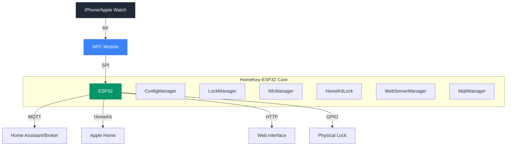

<div align="center">
  

  # HomeKey-ESP32

  [](https://github.com/CsepregiArtur/HomeKey-ESP32/actions/workflows/esp32.yml)
  [](LICENSE)

  **Apple HomeKey functionality for the rest of us**

  ### 📖 [Documentation for this fork](https://csepregiartur.github.io/HomeKey-ESP32/)

  <sub>Original project & documentation: [rednblkx/HomeKey-ESP32](https://github.com/rednblkx/HomeKey-ESP32) · <https://rednblkx.github.io/HomeKey-ESP32/></sub>

</div>

> [!IMPORTANT]
> **This is a fork.** It is based on
> [rednblkx/HomeKey-ESP32](https://github.com/rednblkx/HomeKey-ESP32) (upstream, MIT),
> which remains the original project — all core HomeKey, NFC and HomeKit work is
> theirs. Please send upstream bugs there and use this repository only for the
> fork-specific changes below.
>
> **What this fork adds**
> - **Household / multi-node architecture** — several nodes (gate, main house,
>   garage, …) share trust and recovery material, each with its own
>   non-transferable device identity.
> - **Encrypted, signed household backups** (XChaCha20-Poly1305 + Ed25519).
> - **Authenticated MQTT control** — lock/unlock over HMAC-SHA256 commands with
>   replay protection, plus a documented Home Assistant MQTT discovery surface.
> - **A Home Assistant custom component** ([`homekey_household`](https://github.com/CsepregiArtur/homekey-household)) —
>   manages a whole household either over MQTT or **directly over the node's own
>   HTTPS API with the certificate pinned and no broker required**. Adds lock control,
>   guest-tag management, scheduled backups and "who opened the door" attribution.
> - **Flash encryption, Secure Boot V1 and NVS encryption supported**
>   (implemented but **off by default**; enabling is a deferred, irreversible step —
>   see the security section below).
> - New Web UI pages: household, node, health, security, audit, backup, recovery,
>   provision, update, guest tags.
>
> **What this fork changes or removes**
> - **Firmware updates are dual-slot OTA over the LAN**, or serial. The upstream
>   GitHub updater is gone. See [`docs/content/updates.md`](docs/content/updates.md).
> - **Ethernet is removed** — Wi-Fi only.
> - **Only the PN532 NFC reader is supported.** PN7160/PN7161 and ST25R3916 were
>   removed to free flash for the second OTA slot.
> - **Compile targets: ESP32 and ESP32-C3**, auto-detected when flashing.

The full, fork-specific documentation is published at
**<https://csepregiartur.github.io/HomeKey-ESP32/>**, and its sources are in
[`docs/content/`](docs/content).

## 📚 Documentation

| Page | What it covers |
| --- | --- |
| [**Fork vs Upstream**](https://csepregiartur.github.io/HomeKey-ESP32/fork-vs-upstream/) | Side-by-side list of every difference from the original project. **Start here if you are coming from upstream.** |
| [Prerequisites](https://csepregiartur.github.io/HomeKey-ESP32/prerequisites/) | Hardware and tooling you need before starting |
| [Setup](https://csepregiartur.github.io/HomeKey-ESP32/setup/) | Wiring, flashing, first-run configuration, HomeKit pairing |
| [Configuration](https://csepregiartur.github.io/HomeKey-ESP32/configuration/) | Every Web UI setting, and this fork's extra pages |
| [MQTT](https://csepregiartur.github.io/HomeKey-ESP32/mqtt/) · [Household API](https://csepregiartur.github.io/HomeKey-ESP32/mqtt_household_api/) | Broker setup, legacy topics, and the additive household namespace |
| [**Home Assistant Integration**](https://csepregiartur.github.io/HomeKey-ESP32/home-assistant/) | The `homekey_household` custom component — MQTT **or** a broker-less, certificate-pinned HTTPS transport |
| [Household & Node Architecture](https://csepregiartur.github.io/HomeKey-ESP32/household/) | Multi-node design, node identity, backups |
| [Updates](https://csepregiartur.github.io/HomeKey-ESP32/updates/) | **Dual-slot OTA over the LAN, or serial.** Read before updating. |
| [Security](https://csepregiartur.github.io/HomeKey-ESP32/security/) | Threat model, first-run credentials, optional hardening |
| [Security Rollout Plan](https://csepregiartur.github.io/HomeKey-ESP32/path2_security_rollout/) | The deferred, irreversible hardening procedure |
| [Troubleshooting](https://csepregiartur.github.io/HomeKey-ESP32/troubleshooting/) | Common problems |
| [Guest NFC Tags](https://csepregiartur.github.io/HomeKey-ESP32/guest-tags/) · [HASS Automations](https://csepregiartur.github.io/HomeKey-ESP32/automations/) | Optional extras |
| [API Reference](https://csepregiartur.github.io/HomeKey-ESP32/api/) | Class-by-class reference |

Original project documentation: **<https://rednblkx.github.io/HomeKey-ESP32/>** — the
reference for anything this fork has not changed.

## This fork vs. the original project

This repository is a **fork of [rednblkx/HomeKey-ESP32](https://github.com/rednblkx/HomeKey-ESP32)**.
Upstream is the original project and is where the core HomeKey / HomeKit / NFC work
lives. This table is the complete summary of what differs; the full explanation is
in [`docs/content/fork-vs-upstream.md`](docs/content/fork-vs-upstream.md).

| Area | Original project | This fork (`v0.12.0`) |
| --- | --- | --- |
| Scope | Single device | **Household** of multiple nodes |
| Node identity | — | Ed25519 keypair per node, never cloned |
| Backup | — | **Encrypted** (XChaCha20-Poly1305) + **signed** (Ed25519) |
| Provisioning | — | Single-use, expiring, replay-protected join codes |
| MQTT | Single-device legacy topics | **Additive** household namespace + HA discovery |
| MQTT lock/unlock | Plain numeric payloads | **HMAC-SHA256 authenticated** commands, replay-protected |
| **Home Assistant** | MQTT discovery only | **+ custom component [`homekey_household`](https://github.com/CsepregiArtur/homekey-household)**: MQTT **or** a **broker-less**, certificate-pinned HTTPS transport |
| Web UI | Misc, MQTT, OTA, Logs, Actions | **+ household, node, health, security, audit, backup, recovery, provision, update, guest tags** |
| **Firmware update** | OTA from the Web UI / GitHub updater | **Dual-slot OTA over the LAN** (rollback-enabled) **or serial** via `scripts/ota_update.py`. No GitHub updater. |
| **Connectivity** | Wi-Fi **and Ethernet** (W5500, LAN8720, …) | **Wi-Fi only** — the Ethernet driver was removed |
| **NFC readers** | PN532, PN7160/PN7161, ST25R3916 | **PN532 only** (SPI). The others were removed to free flash for the second OTA slot. |
| **Compile targets** | ESP32, S3, C3, C6 | **ESP32 and ESP32-C3**, auto-detected when flashing |
| Audit log | — | Bounded 256-record log |
| **Flash encryption** | **Disabled** (deliberate) | **Supported** — currently off, AES-256 eFuse key when enabled |
| **Secure Boot** | **Disabled** | **Supported** — currently off, V1 (ECDSA-P256) when enabled |
| **NVS encryption** | **Disabled** | **Supported** — currently off, `nvs_keys` partition when enabled |
| Partition table | `0x8000`, no `nvs_keys` | **Dual-slot `with_ota.csv`**: `app0`/`app1` at 1856 KiB each + `otadata`; moves to `0xD000` with `nvs_keys` when hardening is enabled |

**Unchanged from upstream:** the HomeKey/NFC protocol, `LockManager` lock logic,
the HomeSpan/HomeKit accessory model, and all existing MQTT topic names and
payloads (the household namespace is additive).

**Right now this fork boots and flashes without burning any eFuses** — no device
data is lost. The security features are opt-in and documented in
[`docs/content/PATH2_SECURITY_ROLLOUT.md`](docs/content/PATH2_SECURITY_ROLLOUT.md).

> [!WARNING]
> **Three breaking changes if you are migrating from upstream or an older build of
> this fork.** Ethernet is gone, only PN532 is supported, and the flash layout now
> has two application slots. All three mean a **serial flash and full
> re-provisioning** — Wi-Fi credentials, HomeKit pairing and HomeKey enrolment
> stored on the device are lost. See [Updates](docs/content/updates.md).

## What is HomeKey-ESP32?

The project aims to be the easy DIY solution for using Apple's HomeKey feature without the need to purchase a compatible smart lock that you probably don't want. HomeKey-ESP32 brings Apple's secure NFC-based unlocking to an ESP32 module near you, enabling you to unlock doors and whatnot with a simple tap of your iPhone or Apple Watch.

**No proprietary hardware required** – just an ESP32 and one of the supported NFC modules

> [!CAUTION]
> **This fork *supports* flash encryption, Secure Boot V1 and NVS encryption, but
> they are DISABLED by default.** The board is therefore fully reversible today:
> no one-time eFuses are burned and nothing is destroyed.
>
> Enabling them is a **separate, deferred, one-way step**. Do not enable anything
> until you have read
> [`docs/content/PATH2_SECURITY_ROLLOUT.md`](docs/content/PATH2_SECURITY_ROLLOUT.md).
>
> When you do enable it, the consequences are:
>
> - These protections burn one-time eFuses. There is no way back.
> - **Already-deployed devices must be re-flashed over serial** and completely
>   re-provisioned. Wi-Fi credentials, HomeKit pairing and HomeKey reader
>   enrolment stored on the device **are lost and cannot be recovered**.
> - The partition layout changes (`nvs_keys` added, partition table moved to
>   `0xD000`, app offsets realigned), so firmware from an older build cannot be
>   installed by any route but a serial flash.
> - Every future firmware image must be signed with the Secure Boot key; you can
>   no longer flash arbitrary unsigned binaries.
> - The flash-encryption key and the signing key must both be backed up
>   off-machine. Losing either permanently ends your ability to update the device.
>
> If you are upgrading an existing installation, **back up your household
> recovery secret and HomeKey configuration first**.
>
> **Path 1 / Path 2 — choose deliberately:**
>
> | Path | What it does | Reversible? |
> | --- | --- | --- |
> | **Path 1 — current** | No eFuses burned, no encryption. Behaves like upstream; plaintext flashing works normally. | ✅ Yes |
> | **Path 2 — deferred** | Burns the eFuses, encrypts the flash, Secure Boot locks the device to your signing key. Encrypted + signed images only. | ❌ **Permanent** |
>
> Path 2 is itself staged — flash encryption, then NVS encryption, then Secure
> Boot, then release mode — verifying each stage on hardware before the next.
>
> Upstream deliberately kept flash unencrypted to avoid forcing a migration on
> existing users. This fork keeps that default while making the hardening
> available to those who want it.

## Getting Started

### Prerequisites

- **ESP32 or ESP32-C3 development board** — both are tested and auto-detected when
  flashing.
- **PN532 NFC reader** (SPI mode) — the only supported reader in this fork.
- **USB cable** (for flashing and power; also needed for the first update if you
  are coming from the single-slot layout).
- **Computer** (Windows, Mac, or Linux).
- **A stable 3.3 V supply** — avoid powering the NFC module from a laptop USB port
  if you see unstable behaviour.

> [!NOTE]
> **Ethernet is not supported in this fork.** The upstream driver (W5500, DM9051,
> KSZ8851, LAN8720 and the other RMII PHYs) was removed. This device is Wi-Fi only.

#### PN532 wiring — the pins differ per chip

The defaults come from the Arduino core's per-chip variant, so they are correct on
both chips — but do not copy one column to the other.

| PN532 | ESP32 (VSPI) | ESP32-C3 (FSPI) |
| --- | --- | --- |
| SCK | GPIO18 | **GPIO4** |
| MISO | GPIO19 | **GPIO5** |
| MOSI | GPIO23 | **GPIO6** |
| SS | GPIO5 | **GPIO7** |
| VCC | 3V3 | 3V3 |
| GND | GND | GND |

The PN532 must be in **SPI mode** — on the common red boards, DIP switch `0`/`1`.

> [!IMPORTANT]
> An ESP32-C3 has only GPIO0–21, so the classic ESP32 numbers (18/19/23) **do not
> exist** on it. On a C3 also avoid GPIO9 (boot mode), GPIO8/GPIO2 (strapping),
> GPIO18/19 (native USB) and GPIO20/21 (console UART).

See the [detailed wiring guide](docs/content/setup.md#21-nfc-module-wiring) and
[Prerequisites](docs/content/prerequisites.md).

### Installation Steps

1. **Get the firmware**
   - Take the latest from [this fork's Releases](https://github.com/CsepregiArtur/HomeKey-ESP32/releases), or
   - Build it yourself (see [Building from Source](#building-from-source)).

2. **Connect your hardware**
   - Wire the PN532 to your board using the pinout for *your* chip (above).

3. **Flash the firmware**
   - Easiest, and chip-aware:

     ```bash
     ./scripts/ota_update.py
     ```

     It detects the chip, picks the right bootloader offset and offers to flash
     over the cable, or to discover devices and update them over the network.

   - Or the plain `esptool` route:

     ```bash
     pip install esptool
     esptool.py --port /dev/ttyUSB0 write_flash 0x0 *.firmware.factory.bin
     ```

   - **Prefer a GUI?** Use the [browser-based flasher](https://espressif.github.io/esptool-js/).

4. **Initial setup**
   - Connect to the device's Wi-Fi AP (`HK_XXXXXX`). The password is `HomeKey$123$`
     until you set your own.
   - Open `http://192.168.4.1` **manually** — phones do not auto-open the portal.
   - Configure Wi-Fi credentials, your HomeKit Setup Code and the Web UI login.
   - Open the device's Web UI on your network and finish the **first-run setup
     screen**: Web UI username + password, HomeKit Setup Code and setup AP
     password. **Until you save it the Web UI has no login**, so only do this on a
     trusted network.
   - Pair in the Apple Home app using the Setup Code you chose (the shipped
     `466-37-726` applies until then).

> [!NOTE]
> A factory-fresh device asks you to choose its credentials rather than generating
> and printing them. See [Security](docs/content/security.md) for the full flow and
> for what to do if a credential is lost.

5. **Start using HomeKey!**
   - Hold your iPhone or Apple Watch near the PN532.
   - Enjoy instant, secure access. 🎉

### Updating

Two paths — **over the cable** or **over the network** — documented in full at
[`docs/content/updates.md`](docs/content/updates.md).

**Moving onto the current dual-slot layout needs one serial flash.** A partition
table cannot be delivered over the air: the old table is what tells the device
where to write the new image, and it does not describe the new slots. After that
one cable, every later firmware update can be wireless.

Review [`CHANGELOG.md`](CHANGELOG.md) before updating: some releases change the
flash layout or the security defaults. The
[Security](docs/content/security.md) page explains the first-run setup flow and how
to recover a lost credential.

## System Architecture

<div align="center">
  

```mermaid
graph TD
    A[iPhone/Apple Watch] -->|RF| B[NFC Module]
    B -->|SPI| C[ESP32]
    C -->|MQTT| D[Home Assistant/Broker]
    C -->|HomeKit| E[Apple Home]
    C -->|HTTP| F[Web Interface]
    C -->|GPIO| G[Physical Lock]
    
    subgraph "HomeKey-ESP32 Core"
        C
        H[ConfigManager]
        I[LockManager]
        J[NfcManager]
        K[HomeKitLock]
        L[WebServerManager]
        M[MqttManager]
    end
    
    style A fill:#1f2937,stroke:#374151,color:#fff
    style C fill:#059669,stroke:#047857,color:#fff
    style B fill:#3b82f6,stroke:#2563eb,color:#fff
```

</div>

## ✨ Key Features

### **Apple HomeKey Integration**
- **Express Mode**: Unlock without waking your device
- **Power Reserve**: Unlock even when the device needs to be charged
- **Multi-Device Support**: Works with iPhone and Apple Watch
- **Fast Authentication**: Sub-300ms unlock times

### **Smart Home Ready**
- **HomeKit Native**: Full Apple Home ecosystem integration
- **MQTT Support**: Connect to Home Assistant, OpenHAB, and other platforms
- **Home Assistant Discovery**: Automatic device detection and configuration
- **Custom States**: Support for complex lock states (jamming, unlocking, etc.)

### **Modern Web Interface**
- **Svelte Frontend**: Responsive, modern UI built with Svelte 5 + Tailwind CSS
- **Real-time Updates**: WebSocket-powered live status updates
- **Configuration Management**: Easy setup without recompiling
- **LAN OTA updates**: dual-slot with automatic rollback, or serial when you have
  physical access

### **Developer Friendly**
- **Open Source**: MIT licensed, community-driven development
- **Modular Architecture**: Clean separation of concerns
- **Event System**: Pub/sub architecture for extensibility
- **Comprehensive Logging**: Debug and monitor with detailed logs

## Development

<div align="center">
  

```mermaid
graph TD
  %% External Systems & Hardware
  subgraph "External World"
      A[iPhone / Apple Watch]
      B[Apple Home]
      C[Web Browser]
      D[MQTT Broker]
      E[Physical Lock, Buttons & LEDs]
  end

  %% Main Application on ESP32
  subgraph "HomeKey-ESP32 Core"
      
      subgraph "Interface Managers (I/O)"
          direction LR
          Nfc[NfcManager]
          HK[HomeKitLock]
          Web[WebServerManager]
          Mqtt[MqttManager]
          Hw[HardwareManager]
      end

      subgraph "Logic Core (State Machine)"
          Lock[LockManager]
      end

      subgraph "Data Services (Persistence)"
          direction LR
          Config[ConfigManager]
          Reader[ReaderDataManager]
          NVS[(NVS Storage)]
      end

      %% High-level Data and Control Flow
      DataServices[Data Services] -- "Provides Config & Reader Data" --> InterfaceManagers[Interface Managers]
      DataServices -- "Provides Config" --> LogicCore[Logic Core]
      Config -- "Reads/Writes" --> NVS
      Reader -- "Reads/Writes" --> NVS
      
      InterfaceManagers -- "State Change Requests (e.g., Unlock)" --> Lock
      Lock -- "Actions & State Updates" --> InterfaceManagers
  end
  
  %% Connections to the External World
  A -- NFC --> Nfc
  B -- HomeKit --> HK
  C -- HTTP/WebSocket --> Web
  D -- MQTT --> Mqtt
  E -- GPIO --> Hw
  
  Hw -- GPIO --> E
  HK -- HomeKit --> B
  Web -- HTTP/WebSocket --> C
  Mqtt -- MQTT --> D

  %% Styling for clarity
  style A fill:#1f2937,stroke:#374151,color:#fff
  style B fill:#1f2937,stroke:#374151,color:#fff
  style C fill:#1f2937,stroke:#374151,color:#fff
  style D fill:#1f2937,stroke:#374151,color:#fff
  style E fill:#1f2937,stroke:#374151,color:#fff

  style Nfc fill:#3b82f6,stroke:#2563eb,color:#fff
  style HK fill:#059669,stroke:#047857,color:#fff
  style Web fill:#f59e0b,stroke:#d97706,color:#fff
  style Mqtt fill:#ef4444,stroke:#dc2626,color:#fff
  style Hw fill:#8b5cf6,stroke:#7c3aed,color:#fff

  style Lock fill:#ec4899,stroke:#db2777,color:#fff
  
  style Config fill:#6b7280,stroke:#4b5563,color:#fff
  style Reader fill:#6b7280,stroke:#4b5563,color:#fff
  style NVS fill:#9ca3af,stroke:#6b7280,color:#fff
```

</div>

### Project Structure

```
HomeKey-ESP32/
├── main/                    # Core ESP32 application
│   ├── main.cpp             # Application entry point
│   ├── ConfigManager.cpp    # Configuration management
│   ├── ReaderDataManager.cpp # Reader data management
│   ├── NfcManager.cpp       # NFC communication
│   ├── Pn532Reader.cpp      # PN532 backend (SPI) — the only reader in this fork
│   ├── HomeKitLock.cpp      # HomeKit integration
│   ├── LockManager.cpp      # Lock state management
│   ├── MqttManager.cpp      # MQTT client
│   ├── WebServerManager.cpp # Web interface
│   ├── HardwareManager.cpp  # Hardware manager
│   ├── HouseholdManager.cpp # Household state and trust anchor
│   ├── NodeIdentityManager.cpp # Per-node Ed25519 identity
│   ├── AuditManager.cpp     # Security event log
│   └── HKServices.cpp       # HomeKit services
├── data/                    # Web interface files (Svelte 5)
├── components/              # External dependencies (HomeSpan, HK-HomeKit-Lib, PN532)
├── scripts/
│   ├── ota_update.py        # Cable + network updater, chip auto-detection
│   └── build_esp32c3.sh     # C3 build wrapper (RISC-V assembler workaround)
├── tests/                   # Host-side test scripts
├── with_ota.csv             # ACTIVE partition table (dual-slot)
├── no_ota.csv               # Single-slot fallback
└── docs/                    # Hugo documentation site
    └── content/             # The pages published at the URL above
```

### Core Components

| Component | File | Purpose |
|-----------|------|---------|
| **NFC Manager** | [`NfcManager.cpp`](main/NfcManager.cpp) | Drives the PN532 backend and HomeKey authentication |
| **NFC Backend** | [`Pn532Reader.cpp`](main/Pn532Reader.cpp) | PN532 implementation behind the `INfcReader` interface |
| **HomeKit Bridge** | [`HomeKitLock.cpp`](main/HomeKitLock.cpp) | Manages Apple HomeKit integration and pairing |
| **Lock Manager** | [`LockManager.cpp`](main/LockManager.cpp) | Controls lock state transitions and GPIO actions |
| **MQTT Client** | [`MqttManager.cpp`](main/MqttManager.cpp) | Smart home integration via MQTT |
| **Web Server** | [`WebServerManager.cpp`](main/WebServerManager.cpp) | Configuration UI, HA direct API, and the OTA endpoints |
| **Config Manager** | [`ConfigManager.cpp`](main/ConfigManager.cpp) | Persistent configuration storage |

### Building from Source

Requires **ESP-IDF v5.4 or newer** (CI builds against v5.5.4). Earlier versions do
not compile: the NFC components use `esp_log_buffer.h` and
`spi_bus_dma_memory_alloc`, both introduced in v5.4. See the
[ESP-IDF getting started guide](https://docs.espressif.com/projects/esp-idf/en/latest/esp32/get-started/index.html).

```bash
# 1. Dependencies
git submodule update --init --recursive

# 2. ESP-IDF
. $HOME/esp/esp-idf/export.sh

# 3. Build (classic ESP32)
idf.py build

# 4. Flash and monitor
idf.py -p /dev/ttyUSB0 flash monitor
```

#### Building for the ESP32-C3

The RISC-V toolchain is not installed by default, and on macOS/Homebrew hosts the
build needs one extra step. **Use the wrapper**, which handles both:

```bash
./scripts/build_esp32c3.sh set-target   # one time; wipes build/
./scripts/build_esp32c3.sh build
```

If you build by hand instead, on a macOS/Homebrew host the assembly step fails with
a message that names the wrong component:

```
clang: error: unknown argument: '--traditional-format'
```

GCC *is* running; what breaks is the **assembler**. IDF's `riscv32-esp-elf-as` is a
Rust dispatcher that selects between `riscv32-esp-elf-as-xespv1/v2p1/v2p2`. When it
cannot resolve its variant, GCC's `-print-prog-name=as` reports the bare name `as`,
which the OS resolves to `/usr/bin/as` — Apple clang — which rejects RISC-V flags.
The wrapper puts a directory on `PATH` whose `as` points at the real GNU assembler,
bypassing the dispatcher. Full explanation in
[`docs/content/updates.md`](docs/content/updates.md).

> [!WARNING]
> An interrupted `idf_tools.py install` can leave `riscv32-esp-elf/include/`
> **empty** (0 headers instead of ~72), which later surfaces as
> `fatal error: string.h: No such file or directory`. Reinstall the toolchain to fix
> it. Check with `ls <toolchain>/riscv32-esp-elf/include | wc -l`.

#### Flash budget

| Target | Image size | Free in slot | Headroom |
| --- | --- | --- | --- |
| `esp32` | 1,752,256 B | 148,288 B | **7.80 %** |
| `esp32c3` | 1,870,176 B | 30,368 B | **1.60 %** |

The C3 build is ~118 KB larger and its dual-slot headroom is thin. If size becomes a
problem, `no_ota.csv` is the escape hatch — a single slot with far more room, but no
OTA.

#### Web interface

```bash
cd data && npm install && npm run build
```

`npm run check` (svelte-check) must report 0 errors. `npx eslint src/` reports a
number of pre-existing `no-explicit-any` errors; CI does not run eslint, so leave
those alone and keep new files clean.

### Contributing

Contributions are welcomed! Please see the [Contributing Guidelines](CONTRIBUTING.md) for details.

1. Fork the repository
2. Create a feature branch (`git checkout -b feature/amazing-feature`)
3. Commit your changes (`git commit -m 'feat: Add amazing feature'`)
4. Push to the branch (`git push origin feature/amazing-feature`)
5. Open a Pull Request against the `main` branch

## Support the Project

HomeKey-ESP32 is openly developed and maintained by the community. Your support helps us continue improving the project.

- **Star the repository** to show your appreciation
- **Report bugs** to help improve stability
- **Suggest features** to guide development
- **Share the project** with your network
- **Contribute documentation** to help others

## Credits

### Original project

This repository is a **fork of [rednblkx/HomeKey-ESP32](https://github.com/rednblkx/HomeKey-ESP32)**,
which is the original work. All core HomeKey, NFC, HomeKit and Web UI functionality
was designed and built there, and this fork builds directly on it under the MIT
licence.

- **Original project:** <https://github.com/rednblkx/HomeKey-ESP32>
- **Original documentation:** <https://rednblkx.github.io/HomeKey-ESP32/>

Please send upstream bugs and upstream documentation feedback to the original
project. The documentation published for *this fork* is at
<https://csepregiartur.github.io/HomeKey-ESP32/> and its sources are in
[`docs/content/`](docs/content).

### Built on

- **[@kormax](https://github.com/kormax)**: Reverse-engineered the HomeKey NFC protocol and published the foundational [PoC implementation](https://github.com/kormax/apple-home-key-reader)
- **[@kupa22](https://github.com/kupa22)**: Researched the HAP (HomeKit Accessory Protocol) side of HomeKey
- **[HomeSpan](https://github.com/HomeSpan/HomeSpan)**: Excellent HomeKit framework that powers our integration
- **[HK-HomeKit-Lib](https://github.com/rednblkx/HK-HomeKit-Lib)**: The HomeKey protocol library
- **[ESP-IDF](https://github.com/espressif/esp-idf)**: Robust IoT development framework from Espressif
- **Discord**: <https://discord.com/invite/VWpZ5YyUcm>

## License & Legal

### License

This project is licensed under the **MIT License** - see the [LICENSE](LICENSE) file for details.

### Disclaimer

**Important**: This project implements Apple HomeKey functionality through reverse engineering. While we strive for security and compatibility:

- **Not affiliated** in any shape or form nor condoned by Apple Inc.
- **Use at your own risk** for security-critical applications
- **May lack elements** from Apple's private specifications
- **Subject to change** as Apple updates their protocols

### Trademarks

- **Apple**, **iPhone**, and **Apple Watch** are trademarks of Apple Inc.
- **ESP32** is a trademark of Espressif Systems (Shanghai) Co., Ltd.
- **Home Assistant** is a trademark of Open Home Foundation
